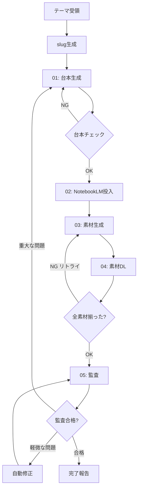

# 00 — 自律ループ（全体統括）

`/run-all` で起動される完全自動モード。
リュウドウからの入力は「テーマ + スタイル」のみで、残りは Claude Code が自律的に進める。

---

## 🔁 全体フロー



---

## 🧭 各工程の責務

1. **台本生成**：`workflows/01-script-generation.md`
   - 出力：`output/scripts/<slug>.md`
   - 失敗条件：マーカー不足、キャラ口調崩壊、YAML欠落
2. **NotebookLM投入**：`workflows/02-notebooklm-upload.md`
   - 出力：`output/final/<slug>-meta.json` に `notebook_id` 記録
3. **素材生成**：`workflows/03-asset-generation.md`
   - 各マーカーに対応する `studio_create` を呼ぶ
4. **素材DL**：`workflows/04-asset-download.md`
   - 保存先：`output/assets/<slug>/`
5. **監査**：`workflows/05-audit.md`
   - 出力：`output/final/<slug>-audit.md`
   - 全項目 PASS で完了

---

## 🛡️ リトライ＆フォールバック

### 台本生成の失敗
- 最大 3 回リトライ
- 3 回失敗したら、失敗した項目を `<slug>-retry.md` に書き出して中断

### NotebookLM 生成失敗
- 一時的なエラー（429, 5xx）→ 60秒待機してリトライ（最大3回）
- 認証エラー → `nlm login` を実行するよう提案し中断
- レート制限（無料枠50q/日超過）→ 残りを翌日に回すため中断し `<slug>-retry.md` 記録

### 素材ダウンロード失敗
- `studio_create` のジョブが PENDING の場合は30秒おきにステータスポーリング（最大10分）
- タイムアウト時は該当マーカーを `FAILED` にマークし監査で赤表示

---

## 📊 状態記録：`<slug>-meta.json`

各工程の完了時に更新する。

```json
{
  "slug": "protac-tpd",
  "title": "PROTACによる標的タンパク質分解の仕組み",
  "style": "zundamon",
  "created_at": "2026-04-23T10:00:00Z",
  "updated_at": "2026-04-23T10:15:00Z",
  "stages": {
    "script_generation": { "status": "done", "path": "output/scripts/protac-tpd.md" },
    "notebooklm_upload": { "status": "done", "notebook_id": "xxx-yyy-zzz" },
    "asset_generation":  { "status": "partial", "jobs": [...] },
    "asset_download":    { "status": "pending" },
    "audit":             { "status": "pending" }
  },
  "markers": [
    { "id": "FIG:1",  "desc": "...", "status": "done", "path": "output/assets/protac-tpd/fig_1.png" },
    { "id": "INFO:1", "desc": "...", "status": "failed", "reason": "timeout" }
  ]
}
```

---

## 🎬 呼び出し例

```
/run-all テーマ：PROTACによる標的タンパク質分解の仕組み / スタイル：ずんだもん
```

Claude Code の応答例（思考過程は省略、進捗のみ簡潔に）：

```
✓ slug生成: protac-tpd
✓ 台本生成完了（4200字、マーカー7個）
✓ NotebookLM ノート作成: xxx-yyy-zzz
✓ 素材生成中... (2/7)
✓ 素材生成中... (7/7)
✓ DL完了: output/assets/protac-tpd/
✓ 監査合格
→ output/final/protac-tpd.md に最終版を出力
```
