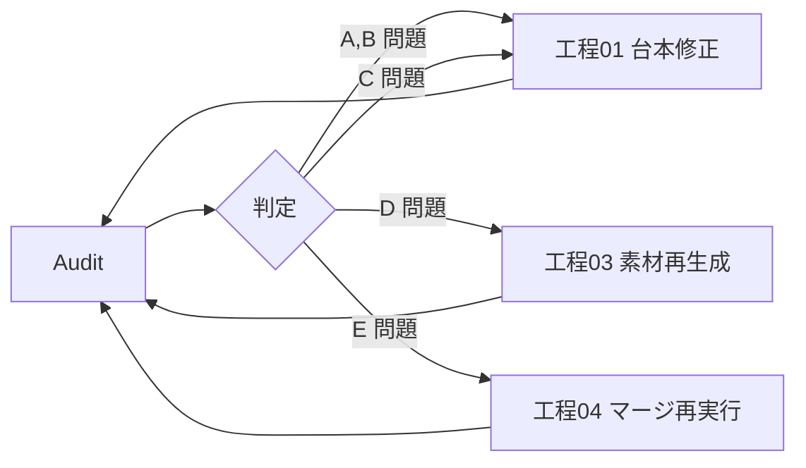

# 05 — 監査（品質チェック）

## 🎯 目的

完成品の整合性・品質を自動チェックし、監査レポートを出力する。
PASS しなければ工程03（素材再生成）または工程01（台本修正）へ差し戻す。

---

## 📥 入力

- `output/scripts/<slug>.md`
- `output/final/<slug>.md`
- `output/assets/<slug>/`
- `<slug>-meta.json`

---

## 📤 出力

- `output/final/<slug>-audit.md`（人間可読のレポート）
- `<slug>-meta.json` の `audit.status = done|warning|fail`

---

## 🧪 チェック項目

### A. 台本構造（必須 / fail 時は工程01に戻る）

- [ ] YAML フロントマターが存在し全フィールド揃っている
- [ ] H1 タイトル = フロントマター `title`
- [ ] セクション数 ≥ 3（イントロ・本編・まとめ以外に）
- [ ] 各セクションに時間目安（`（M:SS–M:SS）`）がある

### B. キャラ一貫性（必須 / fail 時は工程01に戻る）

#### `yukkuri`
- [ ] 霊夢の語尾「〜のよ」「〜ね」「〜じゃない」が最低 5 回
- [ ] 魔理沙の語尾「〜だぜ」「〜なんだぜ」が最低 5 回
- [ ] 「霊夢」「魔理沙」以外の話者名が無い

#### `zundamon`
- [ ] ずんだもんの語尾「〜のだ」が最低 8 回
- [ ] めたんの語尾「〜ですわ」「〜ですのよ」が最低 5 回
- [ ] ずんだもん一人称が「ボク」（ひらがな）
- [ ] めたん一人称が「わたくし」

### C. マーカー整合性（必須 / fail 時は工程03に戻る）

- [ ] マーカー総数 ≥ 4
- [ ] `FIG:1` がイントロに存在
- [ ] `SLIDE:1` がまとめに存在
- [ ] 各本編セクションに最低 1 マーカー
- [ ] マーカー番号が TYPE ごとに連番（欠番・重複なし）
- [ ] マーカー説明文が 40 字以内
- [ ] 同一発話に複数マーカーが無い
- [ ] 連続するマーカーの間に最低 1 発話が挟まっている

### D. 素材ファイル（必須 / 部分 fail は warning）

- [ ] 全 `completed` マーカーに対応するファイルが存在
- [ ] ファイルサイズ > 10 KB
- [ ] 拡張子がタイプと一致（png/pdf/mp4）
- [ ] `failed_permanent` マーカーが全マーカーの 30% 以下

### E. 最終台本（必須）

- [ ] `output/final/<slug>.md` が存在
- [ ] 全マーカーが画像/ファイルリンクに置換済み
- [ ] 相対パス（`../assets/<slug>/...`）が全て解決可能

### F. 参考資料（推奨 / warning）

- [ ] 専門テーマなら `## 📚 参考資料` セクションが存在
- [ ] URL が最低 2 件
- [ ] `// NEEDS_VERIFICATION:` コメントが残っていない

---

## 📋 レポート書式

`output/final/<slug>-audit.md` に下記形式で出力：

```markdown
# 監査レポート: <title>

- **slug**: <slug>
- **style**: <style>
- **生成日時**: <ISO8601>
- **総合判定**: ✅ PASS / ⚠️ WARNING / ❌ FAIL

## サマリー

| カテゴリ | 結果 | 備考 |
|---------|------|------|
| A. 台本構造 | ✅ | 全項目 |
| B. キャラ一貫性 | ✅ | ずんだもん口調 23回、めたん口調 18回 |
| C. マーカー整合性 | ✅ | マーカー 7 個、連番 OK |
| D. 素材ファイル | ⚠️ | 1 件失敗（INFO:3） |
| E. 最終台本 | ✅ | |
| F. 参考資料 | ✅ | URL 4 件 |

## 詳細

### D. 素材ファイル

- ⚠️ `INFO:3` が `failed_permanent` → 最終台本にプレースホルダー挿入済み
- 要アクション：手動で素材配置 or `/fetch-assets --retry INFO:3` で再試行

...

## 推奨アクション

1. `INFO:3` の再生成を試みる（コマンド例）
2. 〜〜
```

---

## 🚨 判定ルール

- **FAIL**：A, B, C, E のいずれかに必須 NG
  → 該当工程に自動で差し戻し、最大 2 回まで自動修正試行
- **WARNING**：D, F に警告あり
  → 完了扱いだがレポートに明記
- **PASS**：全項目 OK

---

## 🔁 自動修正フロー



自動修正 2 回失敗で中断、リュウドウに手動介入を依頼。
